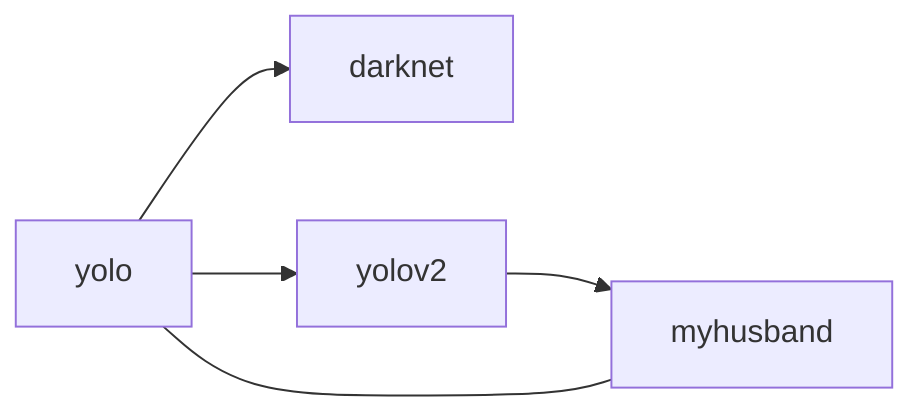

# ROS实践

## 自定义话题类型

1. 创建package

   ```
   catkin_create_pkg test_topic rospy std_msgs
   ```

   

2. 在package下创建msg目录，并编写message程序(person.msg)

   ```
   string name
   uint8 sex
   uint8 age
   
   uint8 unkonw=0
   uint8 male=1
   uint8 female=2
   ```

3. 在package.xml下添加功能包依赖

   ```
   <build_depend>message_generation</build_depend>
   <exec_depend>message_runtime</exec_depend>
   ```

4. 在package下修改CMakeList.txt添加编译选项(4处)

   ```
   find_package(catkin REQUIRED COMPONENTS
     rospy
     std_msgs
     message_generation
   )
   ```

   ```
   add_message_files(
      FILES
      person.msg
   )
   ```

   ```
   catkin_package(
   #  INCLUDE_DIRS include
   #  LIBRARIES test_topic
      CATKIN_DEPENDS rospy std_msgs message_runtime
   #  DEPENDS system_lib
   )
   ```

   ```
   ## Generate added messages and services with any dependencies listed here
   generate_messages(
     DEPENDENCIES
     std_msgs
   )
   ```

   

5. 在package下创建script目录，编写发布话题程序，接受话题程序

   ```
   #!/usr/bin/env python
   # -*- coding: utf-8 -*-
   #该例程将发布/person_info话题，自定义消息类型learning_topic::Person
   
   import rospy
   from test_topic.msg import person
   
   def velocity_publisher():
       #ROS节点初始化
       rospy.init_node('publisher',anonymous=True)
       #创建一个Publisher，发布名为/person_info的topic,消息类型为learning_topic::Person,队列长度为10
       person_info_pub=rospy.Publisher('/person_info',person,queue_size=10)
       #设置循环频率
       rate=rospy.Rate(10)
       while not rospy.is_shutdown():
           #初始化learning_topic::Peson类型的消息
           person_msg=person()
           person_msg.name="ZhangJian";
           person_msg.age=20;
           person_msg.sex=person.male;
           #发布消息
           person_info_pub.publish(person_msg)
           rospy.loginfo("Publish person message[%s,%d,%d]",person_msg.name,person_msg.age,person_msg.sex)
           #按照循环频率延时
           rate.sleep()
   if __name__ == '__main__':
       try:
           velocity_publisher()
       except rospy.ROSInteruptException:
           pass
   ```

   ```
   #!/usr/bin/env python
   # -*- coding: utf-8 -*-
   #该例程将订阅/person_info话题，自定义消息类型learning_topic::Person
   
   import rospy
   from test_topic.msg import person
   
   def personInfoCallback(msg):
       rospy.loginfo("Subscribe Person Info: name:%s age:%d sex:%d",msg.name,msg.age,msg.sex)
   def person_subscriber():
       #ROS节点初始化
       rospy.init_node('person_subscriber',anonymous=True)
       #创建一个Subscriber，订阅名为/person_info的topic，注册回调函数personInfoCallback
       rospy.Subscriber("/person_info",person,personInfoCallback)
       #循环等待回调函数
       rospy.spin()
   if __name__ == '__main__':
       person_subscriber()
   ```

   

6. 给程序添加运行权限

   ```
   chmod +x subscriber.py publisher.py
   ```

   

7. catkin_make编译节点

8. 测试话题

   ```
   roscore
   rosrun test_topic publisher.py
   rosrun test_topic subsciber.py
   ```

   

# YOLO配置

1. 配置SSHkey，如果未配置下载的yolo包不全。[参考链接](https://www.jianshu.com/p/31cbbbc5f9fa/)

2. git clone包，并编译。编译时会自己下载yolo权重文件，花费挺长时间，不敢中途断掉.[github链接](https://github.com/leggedrobotics/darknet_ros)

   ```
   cd catkin_workspace/src
   git clone --recursive git@github.com:leggedrobotics/darknet_ros.git
   cd ../
   catkin_make -DCMAKE_BUILD_TYPE=Release
   ```

3. 下载其他权重文件

   ```
   cd catkin_workspace/src/darknet_ros/darknet_ros/yolo_network_config/weights/
   wget http://pjreddie.com/media/files/yolov2.weights
   wget http://pjreddie.com/media/files/yolov2-tiny.weights
   wget http://pjreddie.com/media/files/yolov2-voc.weights
   wget http://pjreddie.com/media/files/yolov2-tiny-voc.weights
   wget http://pjreddie.com/media/files/yolov3-tiny.weights
   wget http://pjreddie.com/media/files/yolov3.weights
   ```

   

4. 权重文件设置

   `～/catkin_ws/src/darknet_ros/darknet_ros/launch` 文件夹下的 darknet_ros.launch 文件

   ```
   <rosparam command="load" ns="darknet_ros" file="$(find darknet_ros)/config/yolov2-tiny.yaml"/>   #cfg和weight
   # 目前下载的权重文件
   yolov2-tiny.yaml  yolov2.yaml      yolov3.yaml
   yolov2-tiny-voc.yaml  yolov2-voc.yaml   yolov3-voc.yaml
   
   ```

   

5. CPU和GPU设置

   需要修改的文件地址在catkin_ws目录下`～/catkin_ws/src/darknet_ros/darknet`的Makefile文件,如要设置成GPU模式，则设置成下列样式：

   ```
   GPU=1
   CUDNN=1
   OPENCV=1
   OPENMP=0
   DEBUG=0
   #CPU模式默认全是0
   ```

   修改Makefile后在该文件夹终端输入make;

6. 订阅话题

   找到设置路径：/catkin_ws/src/darknet_ros/darknet_ros/config下的ros.yaml文件，将话题名写入第一个小节中：

   ```
   subscribers:
   	camera_reading:
   		topic: /kinect2/qhd/image_color
   		queue_size:1
   
   #默认topic/camera/rgb/image_raw
   ```

   

7. 测试

   ```
   # 运行图像采集节点
   roscore
   roslaunch kinect2_bridge kinect2_bridge.launch depth:method:=cpu reg_method:=cpu
   # 运行图像识别节点
   roslaunch darknet_ros darknet_ros.launch
   ```

   




