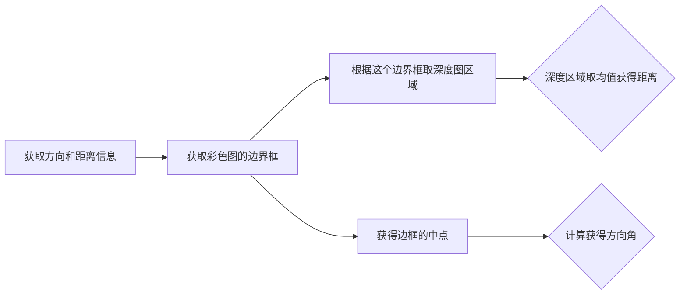
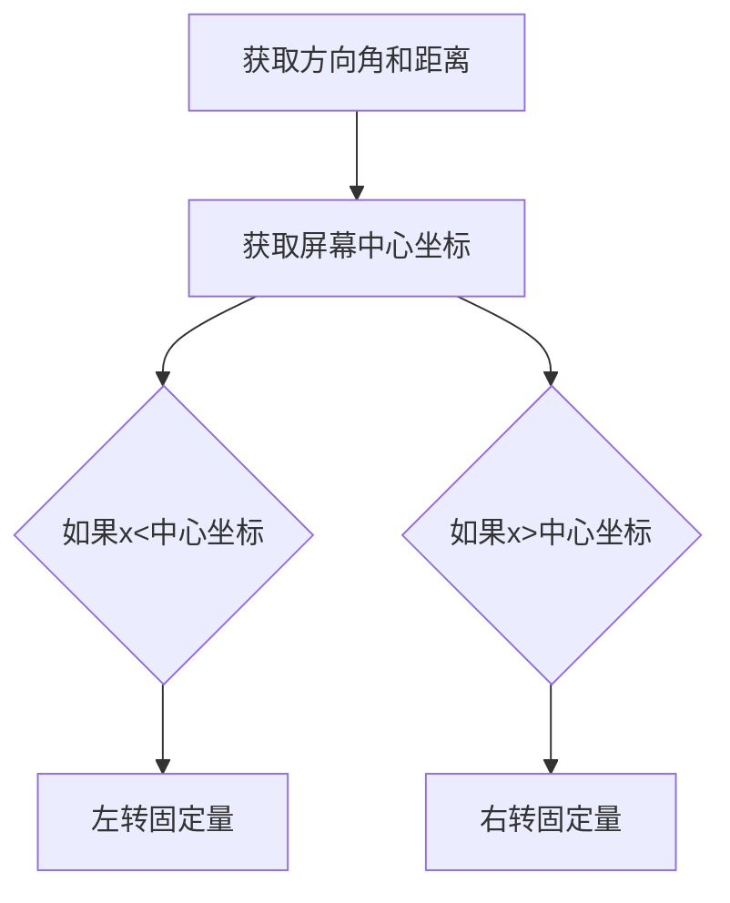

# kinect驱动

## freenect2

[开源链接](https://github.com/OpenKinect/libfreenect2#faq)

Install UsbDk driver,Install libusbK driver,libusb,TurboJPEG,GLFW,OpenCL,CUDA(英伟达) ，OpenNI2

```
#build
mkdir build && cd build
cmake .. -G "Visual Studio 12 2013 Win64"
cmake --build . --config RelWithDebInfo --target install

#test
.\install\bin\Protonect.exe
```

### 依赖问题

- **依赖检测**和**软件安装**不是apt做的，而**是dpkg做的**。
- 依赖不满足**自动修复依赖**才是apt做的。

1. 直接安装或强行安装

   ```
   sudo apt-get install xxxxx
   sudo apt-get -f install
   ```

2. 找到缺失的库手动安装

   找缺失的库一种是因为是国外源，apt-get找不到，只能手动下载。另一种是因为源里没有，通过搜索添加源。通过apt-get安装本地软件一定要写路径，相对绝对都可以，但不能只写包名。不然它会去源里面找不会装本地的。

   ```
   sudo dpkg -i xxxx.deb
   ```

3. 暴力解决

   * --ignore-depends，忽略依赖直接装。

     ```
     #通过dpkg --help查看使用方法
     sudo dpkg --ignore-depends=依赖包 -i 安装包
     ```

   * 解压安装包，删掉依赖字段重新打包

     dpkg -X 只会解压出安装包的文件，无法解压出安装包带的脚本和控制信息。正确解压方式是

     ```
     dpkg-deb -R sogoupinyin_xxxx.deb ./sogou
     # 其目录结构为
     # DEBIAN
     ## conffiles
     ## control
     ## MD5sums
     ## ...
     # etc
     # usr
     ```

     修改control文件里的denpends，接下来打包安装包

     ```
     fakeroot dpkg-deb --build ./sogou mysogou.deb
     ```

   * 修改系统中记录的status软件

     这种方法实质上是伪造依赖，安装过程中（不是安装后也不是前），他就被记录在了系统里。的：`/var/lib/dpkg/status`文件里。这个文件里的内容，也是`dpkg -l` 命令显示内容的信息来源。

     所以，依赖不满足的时候，你可以直接打开这个文件，仿照其他软件的写法，照抄一段加上，把文件名改为缺失的依赖包的名字就可以！dpkg就会认为，系统里有安装这个包，从而解决依赖导致的无法安装的问题。同样，如果出现依赖的包需要的版本不满足的情况，你也可以直接找到文件里对应的包的信息，改掉`Version`字段到一个满足需求的版本就可以。新建一个package换成缺失的依赖包的名字，加到status文件里就可以了。package内容如下：

     ```
     Package: mtest  
     Priority: optional
     Section: editors
     Maintainer: Threedog Team <qiugeyafang@gmail.com>
     Architecture: all 
     Version: 1.0.0
     Homepage: http://www.threedog.top
     Description: test
     ```
     
   * 无视安装失败，直接运行。
   
   

  用`dpkg -S +软件名`查看已经安装的软件在系统里装了哪些东西。找到二进制可执行文件直接运行。

   * 直接拿到根目录，就地解压。
   
     直接把安装包移动到根目录下，然后直接`dpkg -X `解压到当前。然后像刚才一样找二进制可执行程序调用。
   
   * 改掉dpkg源码，直接不检测依赖。
   
     clone下来[dpkg源码](https://git.dpkg.org/git/dpkg/dpkg.git)，在源码里的`packages.c`里面找到这个`dependencies_ok`函数。。甭管他里面写了多少东西，直接在最开头给他`return DEP_CHECK_OK;` 或者`return 2;` 这个函数改的是对`Depends`字段的依赖检测。如果是预依赖，`Pre-Depends:`字段，要改的是另一个名为`depisok`的函数。

### 安装CUDA  toolkit问题

在显卡安装方面，网上的教程参差不齐，甚至上了一回当（通过apt-get 自动安装版本兼容的驱动，后验证为多此一举）。由于多次安装有了经验，提供一种亲测可用的安装过程。

```
# 查看显卡信息
lspci | grep -i nvidia
# 下载CUDA toolkit链接：https://developer.nvidia.com/cuda-downloads
# 确认nouveau被禁用
lsmod | grep nouveau
# 验证安装了gcc
gcc --version
# 给下载好的CUDA可执行权限
sudo chmod a+x cuda_10.2_linux.run
# 运行
sudo ./cuda_9.2_linux.run --no-opengl-libs
--no-opengl-libs：表示只安装驱动文件，不安装OpenGL文件。必需参数，原因同上。注意：不是-no-opengl-files。
--toolkit：表示只安装CUDA Toolkit，不安装Driver和Samples
--help：查看更多高级选项。
# 安装过程中选择安装驱动，一路yes，记住最后显示的信息，写一个log文件放在一个地方，以便后续快速查看。
Driver ：Installed
Toolkit ：Installed in /usr/local/cuda-10.2
Samples ：Installed in /home/vincent
# 添加环境变量（一般在.bashrc中添加）
export CUDA_HOME=/usr/local/cuda-10.2
export PATH="/usr/local/cuda-10.2/bin:$PATH" 
export LD_LIBRARY_PATH="/usr/local/cuda-10.2/lib64:$LD_LIBRARY_PATH" 
# 验证
nvcc -V
#编译并测试设备 deviceQuery：
cd /usr/local/cuda-9.2/samples/1_Utilities/deviceQuery
sudo make
./deviceQuery
#编译并测试带宽 bandwidthTest：
cd ../bandwidthTest
sudo make
./bandwidthTest
```

卸载命令

```
sudo /usr/local/cuda-9.2/bin/uninstall_cuda-10.2.pl
```

驱动卸载命令

```
sudo /usr/bin/nvidia-uninstall
```

# ROS

## ros安装

ros安装中不同的ubuntu对应不同的ros版本，16.04对应kinectic，18.04对应melodic，使用方法上并没有明显差异。但在稳定性上面18.04出现了各种各样的状况。如：无法连接到网络（重启数次后选择性自动修复），显示分辨率突然改变，显示器不正常显示桌面（查了后只能重装CUDA进行解决，但数天后偶尔会再次出现这样的情况）

## 自定义话题类型

1. 创建package

   ```
   catkin_create_pkg test_topic rospy std_msgs
   ```

   

2. 在package下创建msg目录，并编写message程序(person.msg)

   ```
   string name
   uint8 sex
   uint8 age
   
   uint8 unkonw=0
   uint8 male=1
   uint8 female=2
   ```

3. 在package.xml下添加功能包依赖

   ```
   <build_depend>message_generation</build_depend>
   <exec_depend>message_runtime</exec_depend>
   ```

4. 在package下修改CMakeList.txt添加编译选项(4处)

   ```
   find_package(catkin REQUIRED COMPONENTS
     rospy
     std_msgs
     message_generation
   )
   ```

   ```
   add_message_files(
      FILES
      person.msg
   )
   ```

   ```
   catkin_package(
   #  INCLUDE_DIRS include
   #  LIBRARIES test_topic
      CATKIN_DEPENDS rospy std_msgs message_runtime
   #  DEPENDS system_lib
   )
   ```

   ```
   ## Generate added messages and services with any dependencies listed here
   generate_messages(
     DEPENDENCIES
     std_msgs
   )
   ```

   

5. 在package下创建script目录，编写发布话题程序，接受话题程序

   ```
   #!/usr/bin/env python
   # -*- coding: utf-8 -*-
   #该例程将发布/person_info话题，自定义消息类型learning_topic::Person
   
   import rospy
   from test_topic.msg import person
   
   def velocity_publisher():
       #ROS节点初始化
       rospy.init_node('publisher',anonymous=True)
       #创建一个Publisher，发布名为/person_info的topic,消息类型为learning_topic::Person,队列长度为10
       person_info_pub=rospy.Publisher('/person_info',person,queue_size=10)
       #设置循环频率
       rate=rospy.Rate(10)
       while not rospy.is_shutdown():
           #初始化learning_topic::Peson类型的消息
           person_msg=person()
           person_msg.name="ZhangJian";
           person_msg.age=20;
           person_msg.sex=person.male;
           #发布消息
           person_info_pub.publish(person_msg)
           rospy.loginfo("Publish person message[%s,%d,%d]",person_msg.name,person_msg.age,person_msg.sex)
           #按照循环频率延时
           rate.sleep()
   if __name__ == '__main__':
       try:
           velocity_publisher()
       except rospy.ROSInteruptException:
           pass
   ```

   ```
   #!/usr/bin/env python
   # -*- coding: utf-8 -*-
   #该例程将订阅/person_info话题，自定义消息类型learning_topic::Person
   
   import rospy
   from test_topic.msg import person
   
   def personInfoCallback(msg):
       rospy.loginfo("Subscribe Person Info: name:%s age:%d sex:%d",msg.name,msg.age,msg.sex)
   def person_subscriber():
       #ROS节点初始化
       rospy.init_node('person_subscriber',anonymous=True)
       #创建一个Subscriber，订阅名为/person_info的topic，注册回调函数personInfoCallback
       rospy.Subscriber("/person_info",person,personInfoCallback)
       #循环等待回调函数
       rospy.spin()
   if __name__ == '__main__':
       person_subscriber()
   ```

   

6. 给程序添加运行权限

   ```
   chmod +x subscriber.py publisher.py
   ```

   

7. catkin_make编译节点

8. 测试话题

   ```
   roscore
   rosrun test_topic publisher.py
   rosrun test_topic subsciber.py
   ```


## 分布式ROS

1. 先使用下面命令查看两台计算机的局域网IP地址

   ```
   ifconfig 
   ```

2. 打开hosts文件，加入IP地址的映射

   ```
   sudo gedit /etc/hosts
   ```

3. 重启网络服务（间隔为tab键）

   ```
   IP_A　　A
   IP_B　　B
   ```

4. 装上chrony包，用于实现同步

   ```
   sudo apt-get install chrony
   ```

5. 安装ssh工具

   ```
   sudo apt-get install openssh-server
   ```

6. 确认服务器是否已经启动

   ```
   ps -e|grep ssh
   ```

7. 相互ping一下对方机子，看网络通不通

8. 配置环境变量，两台电脑都要加

   ```
   xport ROS_HOSTNAME=[本机ip或映射后的名称]
   export ROS_MASTER_URI=http://[主机ip或映射后的名称]:11311
   ```

9. 主机运行roscore意味着ros master运行在该台服务器上

# YOLO配置

1. 配置SSHkey，如果未配置下载的yolo包不全。[参考链接](https://www.jianshu.com/p/31cbbbc5f9fa/)

2. git clone包，并编译。编译时会自己下载yolo权重文件，花费挺长时间，不敢中途断掉.[github链接](https://github.com/leggedrobotics/darknet_ros)

   ```
   cd catkin_workspace/src
   git clone --recursive git@github.com:leggedrobotics/darknet_ros.git
   cd ../
   catkin_make -DCMAKE_BUILD_TYPE=Release
   ```

3. 下载其他权重文件

   ```
   cd catkin_workspace/src/darknet_ros/darknet_ros/yolo_network_config/weights/
   wget http://pjreddie.com/media/files/yolov2.weights
   wget http://pjreddie.com/media/files/yolov2-tiny.weights
   wget http://pjreddie.com/media/files/yolov2-voc.weights
   wget http://pjreddie.com/media/files/yolov2-tiny-voc.weights
   wget http://pjreddie.com/media/files/yolov3-tiny.weights
   wget http://pjreddie.com/media/files/yolov3.weights
   ```

   

4. 权重文件设置

   `～/catkin_ws/src/darknet_ros/darknet_ros/launch` 文件夹下的 darknet_ros.launch 文件

   ```
   <rosparam command="load" ns="darknet_ros" file="$(find darknet_ros)/config/yolov2-tiny.yaml"/>   #cfg和weight
   # 目前下载的权重文件
   yolov2-tiny.yaml  yolov2.yaml      yolov3.yaml（存在问题）
   yolov2-tiny-voc.yaml  yolov2-voc.yaml（存在问题）   yolov3-voc.yaml（存在问题）
   # 目前下载的cfg文件
   yolov2.cfg       yolov2-tiny-voc.cfg  yolov3.cfg
   yolov2-tiny.cfg  yolov2-voc.cfg       yolov3-voc.cfg
   
   ```

   

5. CPU和GPU设置

   需要修改的文件地址在catkin_ws目录下`～/catkin_ws/src/darknet_ros/darknet`的Makefile文件,如要设置成GPU模式，则设置成下列样式：

   ```
   GPU=1
   CUDNN=1
   OPENCV=1
   OPENMP=0
   DEBUG=0
   #CPU模式默认全是0
   ```

   修改Makefile后在该文件夹终端输入make;

6. 订阅话题

   找到设置路径：/catkin_ws/src/darknet_ros/darknet_ros/config下的ros.yaml文件，将话题名写入第一个小节中：

   ```
   subscribers:
   	camera_reading:
   		topic: /kinect2/qhd/image_color
   		queue_size:1
   
   #默认topic: /camera/rgb/image_raw
   ```

   

7. 测试

   ```
   # 运行图像采集节点
   roscore
   roslaunch kinect2_bridge kinect2_bridge.launch depth:method:=cpu reg_method:=cpu
   # 运行图像识别节点
   roslaunch darknet_ros darknet_ros.launch
   ```
   
## 运行逻辑


## 配置GPU

[cuda官方编译文档](http://docs.nvidia.com/cuda/cuda-compiler-driver-nvcc/index.html#virtual-architecture-feature-list)

1. 更改Makefile前两行GPU和CUDNN的配*GPU=1,CUDNN=1

2. 48~51行，在"ifeq ($(GPU), 1)"语句块中修改为自己的CUDA安装路径，更改前默认路径如下：

   ```
   #修改前
   ifeq ($(GPU), 1) 
   COMMON+= -DGPU -I/usr/local/cuda/include/
   CFLAGS+= -DGPU
   LDFLAGS+= -L/usr/local/cuda/lib64 -lcuda -lcudart -lcublas -lcurand
   #修改后
   ifeq ($(GPU), 1)
   COMMON+= -DGPU -I/usr/local/cuda-10.2/include/
   CFLAGS+= -DGPU
   LDFLAGS+= -L/usr/local/cuda-10.2/lib64 -lcuda -lcudart -lcublas -lcurand
   ```

3. 23行，修改NVCC的路径：NVCC=/usr/local/cuda-10.2/bin/nvcc

4. 运行后看有无报错，如有报错修改ARCH配置

   ```
   ARCH= -gencode arch=compute_30,code=sm_30 \
         -gencode arch=compute_35,code=sm_35 \
         -gencode arch=compute_50,code=[sm_50,compute_50] \
         -gencode arch=compute_52,code=[sm_52,compute_52]
   #      -gencode arch=compute_20,code=[sm_20,sm_21] \ This one is deprecated?
   # This is what I use, uncomment if you know your arch and want to specify
   # ARCH= -gencode arch=compute_52,code=compute_52
   compute_30表示显卡的计算能力是3.0，几款主流GPU的compute capability列表：
       GTX Titan x ： 5.2
       GTX 980      ： 5.2
       Tesla K80    ： 3.7
       Tesla K40    ： 3.5
       K4200         ： 3.0
   ```

   

   


## 问题

### 1. 对视频的识别很不理想

[参考](https://blog.csdn.net/weixin_40717742/article/details/100972018) ：估计是检测是基于rgb格式检测，但是kinect输出的时rbg格式，再加上帧数不高导致的。

之后换了yolov3权重文件后得到极大改善。为了探究是否是图片格式导致的，编写了个bash脚本检查图片格式：

```
#!/bin/bash

if [ $# != 1 ]; then
  echo "parameter error"
else
  len3=`xxd -p -l 3 $1`
  len4=`xxd -p -l 4 $1`

  if [ $len3 == "ffd8ff" ]; then
    echo "The type is jpg"
  elif [ $len4 == "89504e47" ]; then
    echo "The type is png"
  elif [ $len4 == "47494638" ]; then
    echo "The type is gif"
  elif [ $len4 == "52494646" ]; then
    echo "The type is webp"
  elif [ $len4 == "52617221" ]; then
    echo "The type is rar"
  else
    echo "The type is others"
    echo $len4
  fi

fi
```


### 2. 识别之后的帧数很低

* 尝试只识别单张图片，测试后帧数依然很低
* 尝试打开摄像头识别，经测试没有用
* 尝试关闭显示检测后的图片，帧数依然很低
* 看到github的issue，提供的解决办法是代码库的[另一个分支](https://github.com/vivkr/darknet_ros)

## 读取识别框

```
rostopic echo /darknet_ros/bounding_boxes 
header: 
  seq: 325
  stamp: 
    secs: 1588050292
    nsecs: 375590947
  frame_id: "detection"
image_header: 
  seq: 6250
  stamp: 
    secs: 1588050289
    nsecs: 932424906
  frame_id: "kinect2_rgb_optical_frame"
bounding_boxes: 
  - 
    probability: 0.391755372286
    xmin: 425
    ymin: 26
    xmax: 691
    ymax: 220
    id: 56
    Class: "chair"
```

```
/kinect2/bond
/kinect2/hd/camera_info
/kinect2/hd/image_color
/kinect2/hd/image_color/compressed
/kinect2/hd/image_color_rect
/kinect2/hd/image_color_rect/compressed
/kinect2/hd/image_depth_rect
/kinect2/hd/image_depth_rect/compressed
/kinect2/hd/image_mono
/kinect2/hd/image_mono/compressed
/kinect2/hd/image_mono_rect
/kinect2/hd/image_mono_rect/compressed
/kinect2/hd/points
/kinect2/qhd/camera_info
/kinect2/qhd/image_color
/kinect2/qhd/image_color/compressed
/kinect2/qhd/image_color_rect
/kinect2/qhd/image_color_rect/compressed
/kinect2/qhd/image_depth_rect
/kinect2/qhd/image_depth_rect/compressed
/kinect2/qhd/image_mono
/kinect2/qhd/image_mono/compressed
/kinect2/qhd/image_mono_rect
/kinect2/qhd/image_mono_rect/compressed
/kinect2/qhd/points
/kinect2/sd/camera_info
/kinect2/sd/image_color_rect
/kinect2/sd/image_color_rect/compressed
/kinect2/sd/image_depth
/kinect2/sd/image_depth/compressed
/kinect2/sd/image_depth_rect
/kinect2/sd/image_depth_rect/compressed
/kinect2/sd/image_ir
/kinect2/sd/image_ir/compressed
/kinect2/sd/image_ir_rect
/kinect2/sd/image_ir_rect/compressed
/kinect2/sd/points
/rosout
/rosout_agg


darknet_ros_msgs/BoundingBox
darknet_ros_msgs/BoundingBoxes
```


## 写launch文件

https://blog.csdn.net/fengmengdan/article/details/42984429?utm_medium=distribute.pc_relevant.none-task-blog-BlogCommendFromMachineLearnPai2-4&depth_1-utm_source=distribute.pc_relevant.none-task-blog-BlogCommendFromMachineLearnPai2-4

```
<launch>


<include file="$(find kinect2_bridge)/launch/kinect2_bridge.launch">
<arg name="depth_method" value="cpu"/>
<arg name="reg_method" value="cpu"/>
</include>

<include file="$(find turtlebot_bringup)/launch/minimal.launch"/>
<include file="$(find darknet_ros)/launch/darknet_ros.launch"/>
</launch>
```


# 安装turtlebot驱动

## 安装驱动

turtlebot驱动有两个，一个是整体的驱动，一个是底盘的驱动。下面是安装底盘的驱动：

[参考](https://wiki.ros.org/kobuki/Tutorials/Installation)

1. 安装Kobuli驱动

   ```
   sudo apt-get install ros-kinetic-kobuki ros-kinetic-kobuki-core
   ```

2. 添加到用户组

   ```
   sudo usermod -a -G dialout $USER
   ```

3. 设置Udev规则

   ```
   rosrun kobuki_ftdi create_udev_rules
   ```

4. 测试

   ```
   # In a first shell
   $ . /opt/ros/kinetic/setup.bash
   $ roslaunch kobuki_node minimal.launch --screen
   # In a second shell
   $ . /opt/ros/kinetic/setup.bash
   $ roslaunch kobuki_keyop keyop.launch --screen
   ```

   

## 获取深度图和彩色图

### 获取深度信息

在linux下使用libfreenect2开源多平台驱动来获取kinect2.0的传感器信息，得到深度信息，并通过libfreenect2提供的[getPointXYZ](https://openkinect.github.io/libfreenect2/classlibfreenect2_1_1Registration.html#a145c5d0d475a688f4c36ec35b1ac4974)函数，来得到相机坐标系中某一点的空间坐标。


### 重要参数

```
hd:1920x1080
qhd：960x540
sd:512x424
```







## 跟随代码

```
#!/usr/bin/env python
# -*- coding: utf-8 -*-
import rospy
#import cv2
#from cv_bridge import CvBridge
#from sensor_msgs.msg import Image
from geometry_msgs.msg import Twist
from darknet_ros_msgs.msg import BoundingBoxes
'''
def object_position(bounding_box):
    rospy.loginfo("working")
    print(bounding_box.bounding_boxes[0])

rospy.init_node('TurtlebotTracker',anonymous=True)
bounding_boxes_topic = "/darknet_ros/bounding_boxes"
try:
    bounding_boxes_suscriber = rospy.Subscriber(bounding_boxes_topic, BoundingBoxes, object_position)
    rospy.spin()
except:
    print("I dont know!!!")

'''
class TurtlebotTracker():
    def __init__(self):
        self.angle_speed = 0.5
        self.goforwad_speed = 0
        self.xcenter = 490
        self.ycenter = 270
        self.color_topic = "/kinect2/qhd/image_color"
        self.depth_topic = "/kinect2/sd/image_depth"
        self.bounding_boxes_topic = "/darknet_ros/bounding_boxes"
        rospy.init_node('TurtlebotTracker',anonymous=True)

    def listener(self):
        bounding_boxes_suscriber = rospy.Subscriber(self.bounding_boxes_topic, BoundingBoxes, self.object_position)
        rospy.spin()

    def object_position(self, bounding_box):
        rospy.loginfo("working")
        bounding_messages_list = bounding_box.bounding_boxes
        for item in bounding_messages_list:
            #print(item)
            if str(item).split("\n")[6][7:]=="\"person\"":
                self.xmin = int(str(item).split("\n")[1][6:])
                self.ymin = int(str(item).split("\n")[2][6:])
                self.xmax = int(str(item).split("\n")[3][6:])
                self.ymax = int(str(item).split("\n")[4][6:])
                print(self.xmin,self.xmax)
        self.tracker()
    
    def tracker(self):
        rospy.loginfo("traker")
        control_pub = rospy.Publisher("/mobile_base/commands/velocity", Twist, queue_size=10)
        speed = Twist()
        rate = rospy.Rate(2)
        count =0
        while count!=3:
            print(self.xmin,self.xmax)
            speed.linear.x = self.goforwad_speed
            if (self.xmin + self.xmax)/2 < self.xcenter-20:
                speed.angular.z = self.angle_speed
            elif (self.xmin + self.xmax)/2 > self.xcenter+20:
                speed.angular.z = -self.angle_speed
            else:
                speed.angular.z = 0
            control_pub.publish(speed)
            rate.sleep()
            count += 1

if __name__ == "__main__":
    handle = TurtlebotTracker()
    handle.listener()
    #handle.tracker()
    
```
